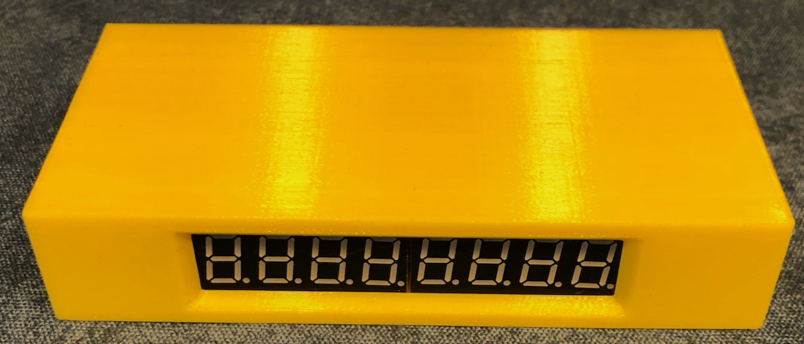
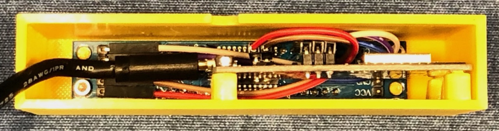
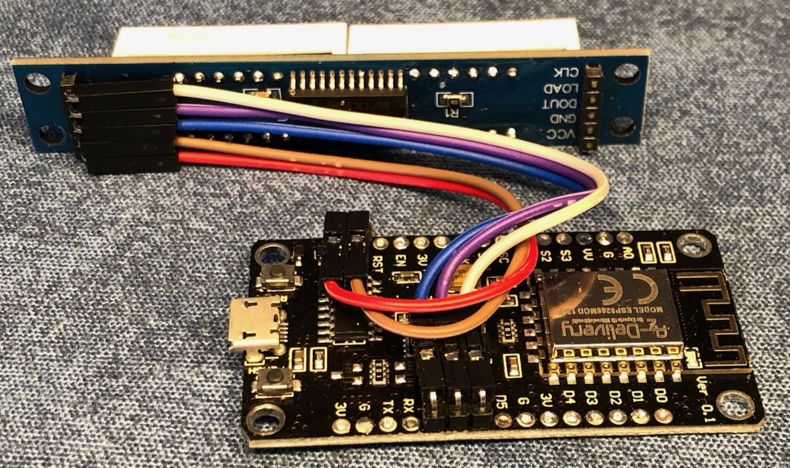

*Disclaimer: This is my first time working with C. Some things might not be ideal.*

# Changes introduced by this fork
- Added new exchange coinbase
- Added option to select multiple pairs on a loop
- (Optional) Show asset part of name
- (Optional) Show value from custom function
- Removed support for Matrix display (I didn't need it)
- Removed old websocket settings and untested exchanges

# Crypto price ticker (websockets) with ESP8266 
- 7-segment 8 digit display
- websocket interfacing for lightning fast, real time updates!
- solderless build possible (if you order the display with pre-soldered pin headers)
- low power (<0.5W), cheap to build

## Components
- NodeMCU
- 7 segment display with MAX7219
- dupont cables

## Wiring 7-segment
NodeMCU | Display
--- | ---
GND | GND
5V/VIN | VCC
D8  | LOAD
D7  | DOUT
D6  | CLK

## My 3D printed case
https://www.thingiverse.com/thing:5171668

## How to install
- compile code and flash board using arduino IDE
- connect board to power
- connect your smartphone/computer to ESPxxxxxx wifi
- enter your home wifi settings at the captive portal

### Required Libraries
- ArduinoJson by Benoit Blanchon
- ArduinoWebsockets by Gil Maimon
- LedControl by Eberhard Fahle
- WiFiManager by tablatronix (original: tzapu)

## Compile help
### Install NodeMCU board information
- Add "https://arduino.esp8266.com/stable/package_esp8266com_index.json" in the Additional Board Manager
- Install esp8266 platform and select it from the board selection menu

## Crypto Donations

- **BTC:** bc1qqa9skjw0av0dnpzl53dhapgllw9nxpr3e3ncg6
- **DOGE:** D6Skk3K4H8KZWc7WcG69Ki5mkXc3f8pscc
- **ETH:** 0x7370eD840A690010eEF5726D71eEa54a9F45A202
- **SOL:** FipyS8kETFE8XRMkDez1nRRNe1n94Etws15UQfvzRsgg
- **XCH:** xch10t2jmnrnq8295pxqdtvn4pp5dgdcm7aar5usz0e4e57xyyjegtuqxwtq9z
